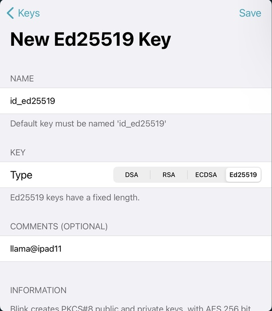
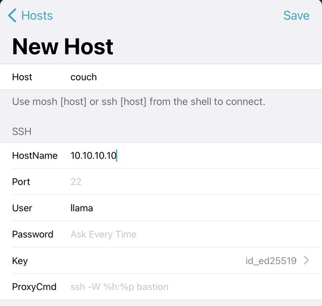
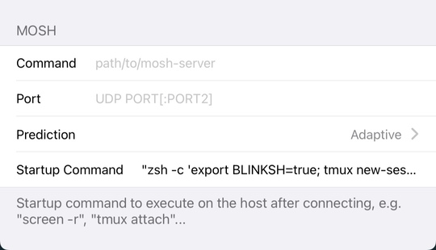
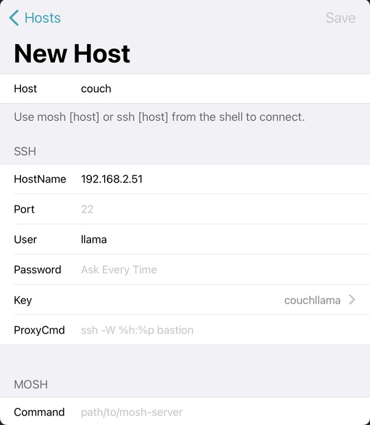
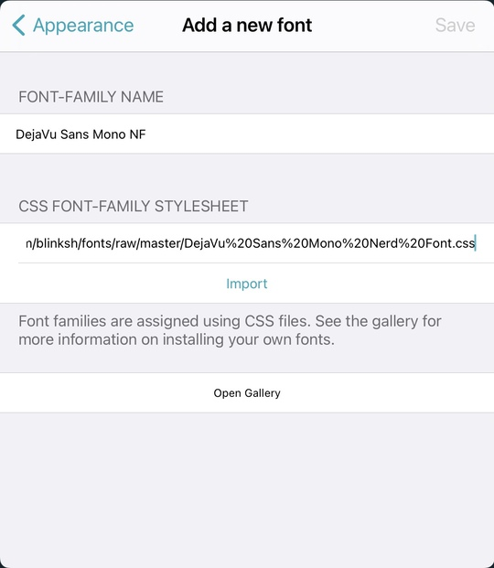
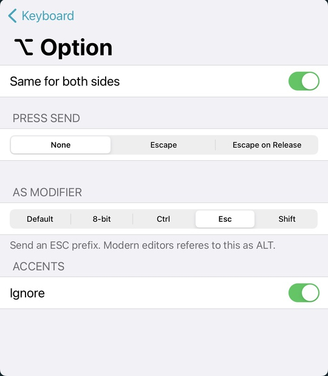
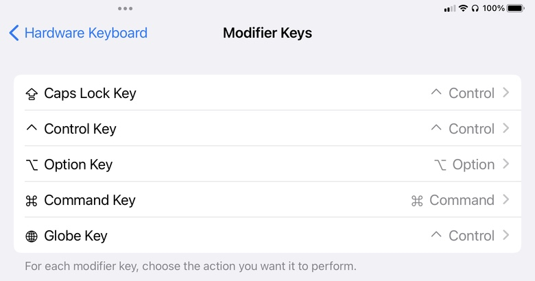

Now that we have a server running mosh we'll want to connect to it. I use the
blink shell app. Here's how I configure blink shell. First thing to do is to
generate a new ssh key. By default it sets up a rsa key. These are depreciated
in new versions of SSH. Instead we want to generate a ed25519 key named
id_ed25519:

After this you want to setup a host. You want to minimally fill out the host,
hostname, and user fields. You can also select a ssh key if you don't want to
use the default one. I also add the following line to the Startup Command:

    "zsh -c 'export BLINKSH=true; tmux new-session -ADs main'"

This sets the BLINKSH variable to true and starts tmux. Tmux will attach to the
session name main if it exists, otherwise it will create it. I create the
BLINKSH variable so that I can check for it in my zshrc scripts

Under Appearance I import a custom theme and font. I like using the cobalt2. It
can be imported from:
`https://raw.githubusercontent.com/thecouchllama/blinksh-cobalt2/main/cobalt2.js`

The blink shell github also contains extra fonts you can import if one of those
suits you more. I use DejaVu Sans Mono NF.
`https://github.com/blinksh/fonts/blob/master/DejaVu%20Sans%20Mono%20Nerd%20Font.css`

The Keyboard can also be customized. I change the caps lock to be escape on
release. I have the caps lock be an extra ctrl key via the hardware keyboard
configuration. This allows me to use it as a modifier key or tap it when I want
to send esc. It's also a good idea to change the option key to be an esc
modifier. This allows it to act as an alt key.

Speaking of the hardware keyboard, I like to set my caps lock and globe key to
control. I'm used to using laptops where the ctrl is is on the outside of the
function key, so I tend to hit the globe instead of the ctrl if I'm going for
it there. I'm also used to having caps lock act as control because it's easier
to reach it with certain key combinations, like ctrl-a.

Blink shell also has a Tips & Tricks page, which contains a number of useful
configuration pieces. One of them is setting up copy/paste via OSC 52. To set
this up in tmux, add the following to your tmux.conf:

    set -s set-clipboard on
    set -ag terminal-overrides "vte*:XT:Ms=\\E]52;c;%p2%s\\7,xterm*:XT:Ms=\\E]52;c;%p2%s\\7"

Note: I've found that these options tend to work better after other
terminal-overrides, such as enabling true color.

For vim/neovim you can install the
[ojroques/vim-oscyank](https://github.com/ojroques/vim-oscyank) plugin and set
a key to run `` :OSCYank <CR>`. For example, I have `<Leader>y `` to perform
this. It's also possible to always sync the vim clipboard to the main
clipboard, however I find that annoying since I don't paste out of vim that
often.
